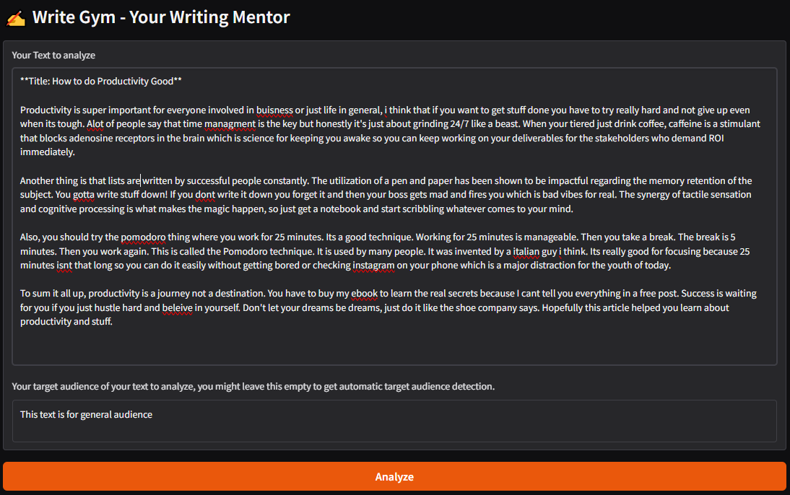
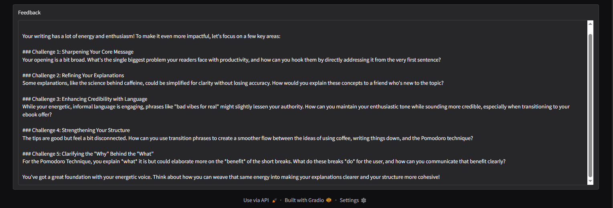

# Write Gym


## Table of Contents

- [About The Project](#about-the-project)
- [Built With](#built-with)
- [Getting Started](#getting-started)
  - [Prerequisites](#prerequisites)
  - [Installation](#installation)
  - [Running the App (Web UI)](#running-the-app-web-ui)
- [Usage](#usage)
- [License](#license)
- [Contact](#contact)
- [Acknowledgments](#acknowledgments)

## About The Project

**Write Gym** is an AI-powered _writing mentor_ — it doesn’t rewrite your text for you. Instead, it analyzes your writing and challenges you with questions to help you improve your content on your own. This agent respects the writer's intelligence and creative autonomy, and only wants to point into potential improvements.

### Built With

- Python
- [Google ADK (Agent Development Kit)](https://google.github.io/adk-docs/)
- [Textstat](https://github.com/textstat/textstat)

<p align="right">(<a href="#readme-top">back to top</a>)</p>

## Getting Started

### Prerequisites

- A valid Google ADK key
- Conda or Miniconda installed

<p align="right">(<a href="#readme-top">back to top</a>)</p>

### Installation

```bash
git clone https://github.com/damiankuras/write-gym.git
cd write-gym
```

#### Set up conda environment.

```bash
conda env create -f environment.yml
```

```bash
conda activate write-gym-env
```

#### Api keys

Rename the .env.example in /agent folder to .env first.
Then set up the google adk key in /agent/.env file.

#### Running the App (Web UI)

```bash
python web_ui.py
```

Open the URL shown (e.g. http://localhost:7860) to access the interface.

<p align="right">(<a href="#readme-top">back to top</a>)</p>

## Usage

1. Paste in your draft or finished blog post, essay, or any text you want feedback on.

2. Submit it and receive AI-powered writing lesson.

3. Use the challenges to revise, re-submit if you like — and grow your writing skills over time.

Write Gym works best for content where clarity, tone, audience alignment and structure matter.

For example:




<p align="right">(<a href="#readme-top">back to top</a>)</p>

## License

Distributed under the MIT License. See `LICENSE` for more information.

<p align="right">(<a href="#readme-top">back to top</a>)</p>

## Contact

Damian Kuraś - damian_kuras@outlook.com

Project Link: [https://github.com/DamianKuras/write-gym](https://github.com/DamianKuras/write-gym)

<p align="right">(<a href="#readme-top">back to top</a>)</p>

## Acknowledgments

- [Google adk](https://google.github.io/adk-docs/)
- [Textstat](https://github.com/textstat/textstat)

<p align="right">(<a href="#readme-top">back to top</a>)</p>
